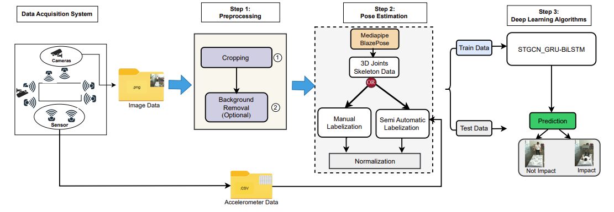
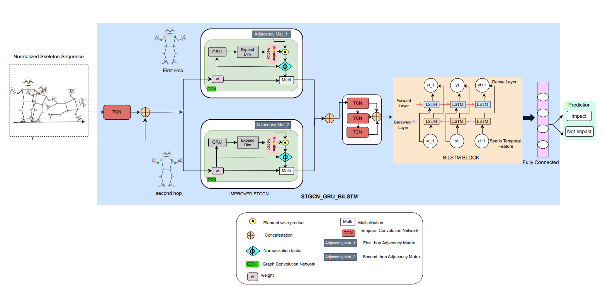

# Impact Detection in Fall Events Using STGCN-GRU-BiLSTM

[](https://www.python.org/downloads/)
[](https://www.tensorflow.org/)
[](https://opensource.org/licenses/MIT)
[](https://doi.org/10.1007/s41666-025-00215-7)

**Authors:** Tresor Y. Koffi, Youssef Mourchid, Mohammed Hindawi, Yohan Dupuis  
**Affiliation:** CESI LINEACT Laboratory, UR 7527  
**Published:** Journal of Healthcare Informatics Research (2025)

---

## 📄 Abstract

Falls represent a significant risk among elderly individuals. This work addresses impact detection within fall events by leveraging **Spatio-Temporal Graph Convolutional Networks (STGCN)**, **Gated Recurrent Units (GRU)**, and **Bidirectional LSTM (BiLSTM)** using **3D skeleton data**. Our approach achieves **97.5% accuracy** in detecting the precise moment when a person makes contact with the ground during a fall, significantly reducing false positives.

**Dataset:** Improved 3D Skeleton UP-Fall Dataset available at [Zenodo](https://zenodo.org/records/12773013)

## 🎯 Key Contributions

1. **Improved 3D Skeleton Dataset**: Enhanced UP-Fall dataset with better preprocessing and labeling
2. **STGCN Architecture**: Captures spatial and temporal dependencies in skeletal joint movements
3. **GRU Integration**: Efficient temporal modeling to identify joint contributions during falls
4. **BiLSTM Enhancement**: Bidirectional analysis for precise impact moment detection
5. **High Accuracy**: 97.5% accuracy in impact detection across various fall scenarios


## 🔄 Methodology Overview

### Complete Pipeline



**Pipeline Overview**: The complete workflow consists of three main steps:
1. **Data Acquisition**: Multimodal data from cameras and accelerometers
2. **Preprocessing**: Image cropping, background removal, and pose estimation using MediaPipe BlazePose
3. **Deep Learning**: STGCN-GRU-BiLSTM architecture for impact detection

### STGCN-GRU-BiLSTM Architecture



**Architecture Components**:
- **STGCN**: Captures spatial-temporal relationships using 2-hop graph convolution
- **GRU**: Efficient temporal modeling with attention mechanism
- **BiLSTM**: Bidirectional analysis for precise impact moment detection

## 🚀 Key Results

| Model Architecture | Accuracy | Precision | F1-Score |
|-------------------|----------|-----------|----------|
| STGCN (Baseline) | 92.16% | 94.16% | 91.31% |
| STGCN + ConvLSTM | 93.00% | 95.00% | 92.14% |
| STGCN + GRU | 93.50% | 93.36% | 92.68% |
| **STGCN-GRU-BiLSTM (Ours)** | **97.50%** | **98.11%** | **97.26%** |

### Performance by Fall Type:
- **Falling Backward (Standing)**: 96.50%
- **Falling While Sitting**: 97.50%
- **Falling Forward (Hands)**: 90.00%
- **Falling Sideward**: 90.00%

## 📊 Dataset

### UP-Fall Dataset
- **Subjects**: 17 healthy adults (9 males, 8 females, ages 18-24)
- **Fall Types**: 11 activities (5 falls + 6 ADLs)
- **Sensors**: Multiple cameras + accelerometers
- **3D Joints**: 33 joints extracted using MediaPipe BlazePose
- **Sampling Rate**: 18 Hz

### Improved Dataset Features:
- Advanced background removal using GrabCut algorithm
- Optimized image cropping (500×700 pixels)
- Semi-automatic labeling using accelerometer SMV analysis
- Enhanced 3D skeleton extraction

**Download**: [Improved UP-Fall Dataset on Zenodo](https://zenodo.org/records/12773013)

## 🛠️ Installation

### Prerequisites
- Python 3.8 or higher
- CUDA-compatible GPU (recommended)
- 16GB RAM minimum

### Clone Repository
```bash
git clone https://github.com/Tresor-Koffi/impact-fall-detection-stgcn.git
cd impact-fall-detection-stgcn
```

### Install Dependencies
```bash
pip install -r requirements.txt
```

## 📁 Project Structure

```
STGCNGRU_BILSTM/
├── Data/                              # Dataset folder
├── GCN/                               # Graph Convolution Network modules
├── logs/                              # Training logs
├── models/                            # Saved model architectures
├── plots/                             # Visualization outputs
├── results/                           # Experimental results
├── best_stgcn_gru_bilstmmodel.hdf5   # Best trained model
├── stgcn_gru_bilstm_model.json       # Model architecture (JSON)
├── train.py                           # Training script
└── README.md                          # This file
```

## 💻 Usage

### Training the Model

```bash
python train.py --epochs 300 \
                --batch_size 8 \
                --learning_rate 0.0001 \
                --sequence_length 100
```

### Using Pre-trained Model

```python
from tensorflow.keras.models import load_model

# Load the trained model
model = load_model('best_stgcn_gru_bilstmmodel.hdf5')

# Load your 3D skeleton data
# X_test shape: (samples, 100, 33, 3)  # 100 frames, 33 joints, 3D coordinates

# Predict impact
predictions = model.predict(X_test)
```

### Extracting 3D Skeleton Data

```python
import mediapipe as mp
import cv2

# Initialize MediaPipe BlazePose
mp_pose = mp.solutions.pose
pose = mp_pose.Pose(
    static_image_mode=False,
    model_complexity=2,
    enable_segmentation=True,
    min_detection_confidence=0.5
)

# Process video frames
# Extract 33 joints (x, y, z) coordinates
# Normalize and prepare for model input
```

## 🔬 Methodology

### Architecture Overview

1. **Input**: 3D skeleton sequence (T×N×C)
   - T = 100 frames
   - N = 33 joints
   - C = 3 coordinates (x, y, z)

2. **STGCN Layers**: 
   - Capture spatial relationships between joints
   - Extract temporal features across frames
   - Use 2-hop adjacency matrix

3. **GRU Layers**:
   - Efficient temporal sequence modeling
   - Identify joint contribution to falls
   - Faster than LSTM with comparable performance

4. **BiLSTM Layer**:
   - Bidirectional temporal analysis
   - Captures past and future context
   - Precise impact moment detection

5. **Output**: Binary classification (Impact / No Impact)

### Preprocessing Pipeline

1. **Image Cropping**: 500×700 pixels focused on subject
2. **Background Removal**: GrabCut algorithm
3. **3D Pose Estimation**: MediaPipe BlazePose (33 joints)
4. **Normalization**: Z-score normalization
5. **Labeling**: Semi-automatic using accelerometer SMV (2g threshold)

## 📈 Training Details

| Parameter | Value |
|-----------|-------|
| Epochs | 300 |
| Batch Size | 8 |
| Learning Rate | 0.0001 |
| Optimizer | Adam |
| Loss Function | Binary Cross-Entropy |
| Dropout | 0.25 |
| K-hops | 2 |
| Hidden Units | 80, 40, 40, 80 |
| GRU Units | 33, 33 |
| Sequence Length | 100 frames |

**Training Time**: 41 minutes (GeForce GTX 3080 Ti, 16GB)  
**Inference Time**: 12 seconds per batch

## 🎯 Key Features

### Attention Mechanism
The model uses attention vectors to identify critical body joints during falls:
- **Head**: Primary impact point in forward falls
- **Right Shoulder**: Critical in lateral falls
- **Left Hip**: Important in backward falls
- **Right Knee**: Key for seated falls

### Cross-Dataset Validation
- Trained on UP-Fall, tested on UMAFall dataset
- Maintains 94% accuracy across different datasets
- Demonstrates strong generalization capability

## 📖 Citation

If you use this code or dataset in your research, please cite:

```bibtex
@article{koffi2025impact,
  title={Impact Detection in Fall Events: Leveraging Spatio-temporal Graph Convolutional Networks and Recurrent Neural Networks Using 3D Skeleton Data},
  author={Koffi, Tresor Y. and Mourchid, Youssef and Hindawi, Mohammed and Dupuis, Yohan},
  journal={Journal of Healthcare Informatics Research},
  year={2025},
  publisher={Springer},
  doi={10.1007/s41666-025-00215-7}
}
```

## 📄 License

This project is licensed under the MIT License - see the [LICENSE](LICENSE) file for details.

## 🤝 Contributing

Contributions are welcome! Please feel free to submit a Pull Request.

## 📧 Contact

For questions or collaborations:
- **Tresor Y. Koffi**: ytkoffi@cesi.fr
- **CESI LINEACT Laboratory**: UR 7527

## 🔗 Links

- [Paper (Springer)](https://doi.org/10.1007/s41666-025-00215-7)
- [Improved UP-Fall Dataset (Zenodo)](https://zenodo.org/records/12773013)
- [Original UP-Fall Dataset](https://sites.google.com/up.edu.mx/har-up/)
- [CESI LINEACT Laboratory](https://www.cesi.fr/)

## 🙏 Acknowledgments

- UP-Fall Dataset creators
- MediaPipe team for BlazePose algorithm
- CESI LINEACT Laboratory
- Journal of Healthcare Informatics Research

---

**Note**: This repository contains the implementation of deep learning-based impact detection published in the Journal of Healthcare Informatics Research (2025).

